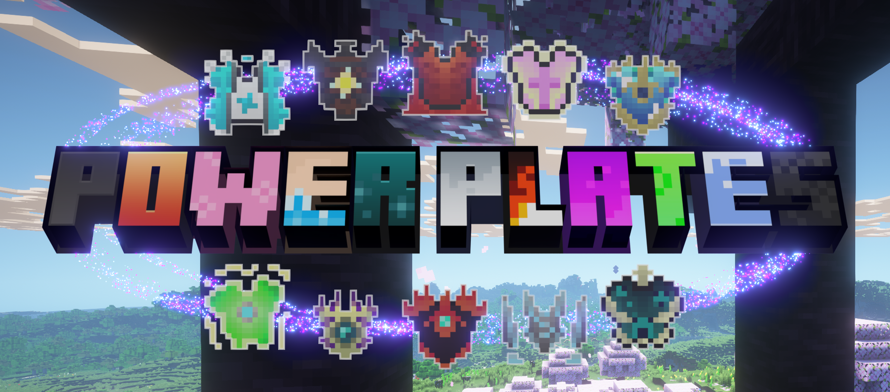
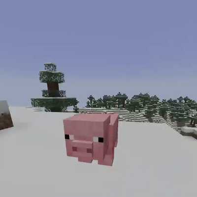
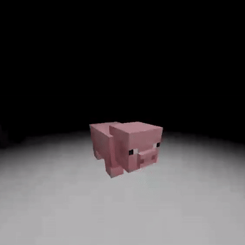

# What is this?
This is a Minecraft datapack where the main content is focused on chestplates that give unique abilities.

Thats not all, there are plenty of QOL features like ranks, custom commands, spawn and pvp regions *(may incompatible with your world)*, and more! Without a single plugin or mod required!

All chestplates have a **passive** and **event** ability. Passive abilities are *always* active, while event abilities are activated manually and are much stronger, but they have a cooldown.

Examples of these abilities include:
 * **Silent** (passive):
   * The wearer is permanently blinded but can sense entities through walls.
 * **Oceanic** (passive):
   * The wearer is really slow on land, but has water breathing and is extremely agile underwater.
 * **Uranium** (event):
   * BIG KABOOM.
 * **Speedster** (event):
   * Spawns a big tornado which throws everything high up in the air.

# GIFS
### **Ice** chestplate event

### **Silent** chestplate passive

# Open-source
**This is open-source, read the [LICENSE](/LICENSE) for info on what is allowed and isn't. DO NOT EXPECT PROFESSIONAL QUALITY.**

**NOTE: If you wish to use this datapack for yourself, not all files are compatible with every world (some files contain for example: specific coordinates). There will be a list of incompatible files in** [incompatible-files.txt](/incompatible-files.txt) **, aswell as instructions to remove the incompatibility if you wish to modify certain files.**

# Special thanks

### Special thanks to these people for helping me with this project

Huge thanks to KPOW for the amazing suggestions and art they've designed

**Playtesters:**\
8BitBiscotti, KPOW

**Text revising:**\
Reckless

**Texture pack artists:**
KPOW

Gotta give credits to myself (Byte Dice) for coding everything
